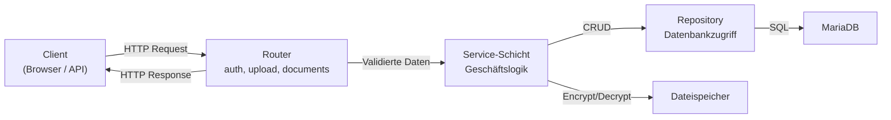

# API-Referenz

Die API-Dokumentation beschreibt die Schnittstellen des Dokumentenmanagers. Die Live-Referenz bleibt die automatische OpenAPI-Spezifikation unter `/docs` (Swagger UI). Diese Seite verdichtet die wesentlichen Endpunkte und ordnet sie fachlich ein.

---

## OpenAPI / Swagger

| URL | Funktion |
|---|---|
| `GET /docs` | Swagger UI – interaktive API-Dokumentation |
| `GET /openapi.json` | OpenAPI-Spezifikation als JSON |

FastAPI generiert die OpenAPI-Beschreibung automatisch aus den Routen-Definitionen und Pydantic-Schemas. Die API ist damit formal dokumentiert, testbar und maschinenlesbar.

---

## Authentifizierung

Die Anwendung unterstützt zwei Authentifizierungsmechanismen:

- **Cookie-basiert** für Web-Routen (HTML) – JWT wird im HTTP-Only-Cookie gespeichert
- **Bearer-Token** für API-Routen (JSON) – JWT im `Authorization`-Header

Alle geschützten Endpunkte erfordern einen gültigen JWT-Token. Nicht authentifizierte Zugriffe auf HTML-Routen werden automatisch zur Login-Seite umgeleitet.

---

## Endpunkte nach Fachbereich

### Authentifizierung (`/auth`)

| Methode | Pfad | Zweck |
|---|---|---|
| POST | `/auth/register` | Benutzerregistrierung (JSON) |
| POST | `/auth/login` | Login mit JSON-Response |
| POST | `/auth/logout` | Logout, Token invalidieren |
| POST | `/auth/mfa/verify` | MFA-Code verifizieren |
| POST | `/auth/password-reset/start` | Passwort-Reset initiieren |
| GET | `/auth/login-web` | Login-Formular (HTML) |
| POST | `/auth/login-web` | Login über Webformular |
| GET | `/auth/register-web` | Registrierungsformular (HTML) |
| POST | `/auth/register-web` | Registrierung über Webformular |
| GET | `/auth/verify/sent` | Verifikations-E-Mail-Bestätigung |
| GET | `/auth/password-reset` | Reset-Formular (HTML) |
| GET | `/auth/password-reset/confirm` | Reset-Bestätigung mit Token |

### Dokumente (`/documents`)

| Methode | Pfad | Zweck |
|---|---|---|
| GET | `/documents` | Dokumentliste mit optionaler Suche und Paginierung |
| GET | `/documents/{id}` | Dokumentdetail mit Metadaten und Versionen |
| GET | `/documents/{id}/download` | Datei herunterladen (entschlüsselt) |
| GET | `/documents/{id}/view` | Dokumentvorschau im Browser |
| GET | `/documents/{id}/versions` | Versionshistorie anzeigen |
| POST | `/documents/{id}/rename-web` | Dokument umbenennen |
| POST | `/documents/{id}/delete-web` | In den Papierkorb verschieben |
| POST | `/documents/{id}/set-categories-web` | Kategorien zuordnen |
| POST | `/documents/{id}/upload-version-web` | Neue Version hochladen |
| POST | `/documents/{id}/restore-version-web` | Ältere Version wiederherstellen |
| POST | `/documents/bulk-assign-category` | Kategorie für mehrere Dokumente setzen |

### Upload

| Methode | Pfad | Zweck |
|---|---|---|
| GET | `/upload` | Upload-Formular (HTML) |
| POST | `/upload` | Upload mit JSON-Response |
| POST | `/upload-web` | Upload über Webformular |
| POST | `/upload-web/duplicate/commit` | Duplikat-Upload bewusst übernehmen |
| POST | `/upload-web/duplicate/discard` | Zwischengespeicherten Upload verwerfen |

### Kategorien

| Methode | Pfad | Zweck |
|---|---|---|
| GET | `/categories/{id}` | Kategoriedetail mit zugehörigen Dokumenten |
| POST | `/categories/create-web` | Neue Kategorie anlegen |
| POST | `/categories/rename-web` | Kategorie umbenennen |
| POST | `/categories/delete-web` | Kategorie löschen |
| POST | `/categories/{id}/update-keywords-web` | Keywords aktualisieren |

### Papierkorb (`/trash`)

| Methode | Pfad | Zweck |
|---|---|---|
| GET | `/trash` | Papierkorb anzeigen |
| POST | `/trash/{id}/restore-web` | Dokument wiederherstellen |

### Suche

| Methode | Pfad | Zweck |
|---|---|---|
| GET | `/search` | Volltextsuche über Titel, OCR-Text und Metadaten |

### Benutzerverwaltung

| Methode | Pfad | Zweck |
|---|---|---|
| GET | `/users` | Benutzerliste (Admin) |
| GET | `/profile` | Eigenes Profil |
| POST | `/profile/mfa/enable` | MFA aktivieren |
| POST | `/profile/mfa/disable` | MFA deaktivieren |

### Weitere Endpunkte

| Methode | Pfad | Zweck |
|---|---|---|
| GET | `/dashboard` | Dashboard mit Kennzahlen |
| GET | `/favorites` | Favoritenübersicht |
| GET | `/category-keywords` | Keywords-Verwaltungsseite |
| GET | `/security-info` | Sicherheitsinformationen |
| POST | `/debug-ocr/test` | OCR-Test für Debugging |
| GET | `/audit-logs` | Audit-Protokoll (Admin) |

---

## Request- und Response-Muster

### Upload – Erfolg

**Request:** `POST /upload` mit Multipart-Datei und optionalen Metadaten

```json
{
  "id": 42,
  "filename": "Vertrag.pdf",
  "status": "created",
  "duplicate_detected": false
}
```

### Upload – Duplikatfall

```json
{
  "status": "pending_decision",
  "duplicate_detected": true,
  "pending_upload_id": 17
}
```

Der Client erhält nicht nur „ja oder nein", sondern den nächsten sinnvollen Entscheidungspfad – entweder übernehmen (`/duplicate/commit`) oder verwerfen (`/duplicate/discard`).

### Dokumentliste

```json
[
  {
    "id": 1,
    "filename": "Rechnung_2026.pdf",
    "mime_type": "application/pdf",
    "is_favorite": true,
    "is_deleted": false
  }
]
```

### OCR-Debug

```bash
curl -X POST "http://127.0.0.1:8000/debug-ocr/test" \
  -H "accept: application/json" \
  -F "file=@sample.pdf"
```

```json
{
  "filename": "sample.pdf",
  "pages": 3,
  "extracted_text_preview": "Dies ist ein Beispieltext ..."
}
```

---

## Fehlercodes

| HTTP-Code | Bedeutung | Typischer Auslöser |
|---|---|---|
| 400 | Bad Request | Fehlende oder ungültige Eingaben |
| 401 | Unauthorized | Nicht authentifiziert |
| 403 | Forbidden | Authentifiziert, aber ohne Berechtigung |
| 404 | Not Found | Dokument oder Ressource existiert nicht |
| 409 | Conflict | Duplikat- oder Statuskonflikte |
| 422 | Validation Error | Pydantic-Validierungsfehler |
| 500 | Internal Server Error | Unerwarteter Serverfehler |

---

## Datenfluss



Die konsequente Trennung zwischen Router, Service und Repository macht das System testbar und erweiterbar. Neue Endpunkte können hinzugefügt werden, ohne bestehende Geschäftslogik zu berühren.
