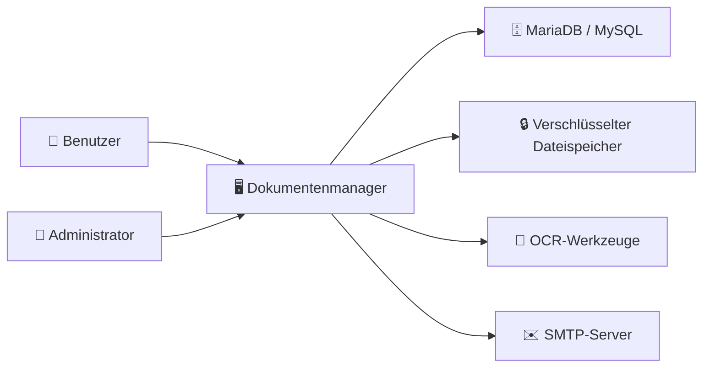
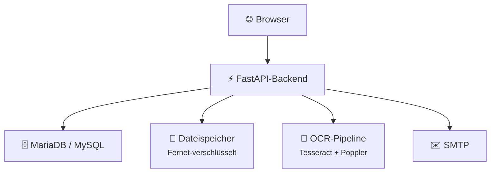
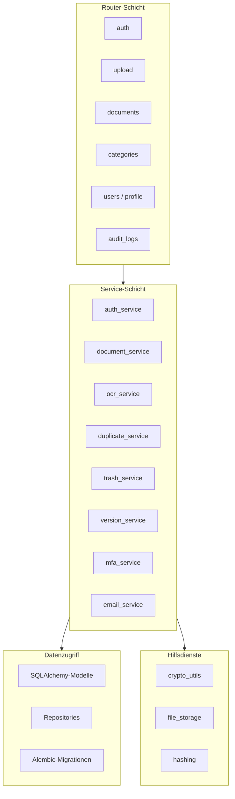
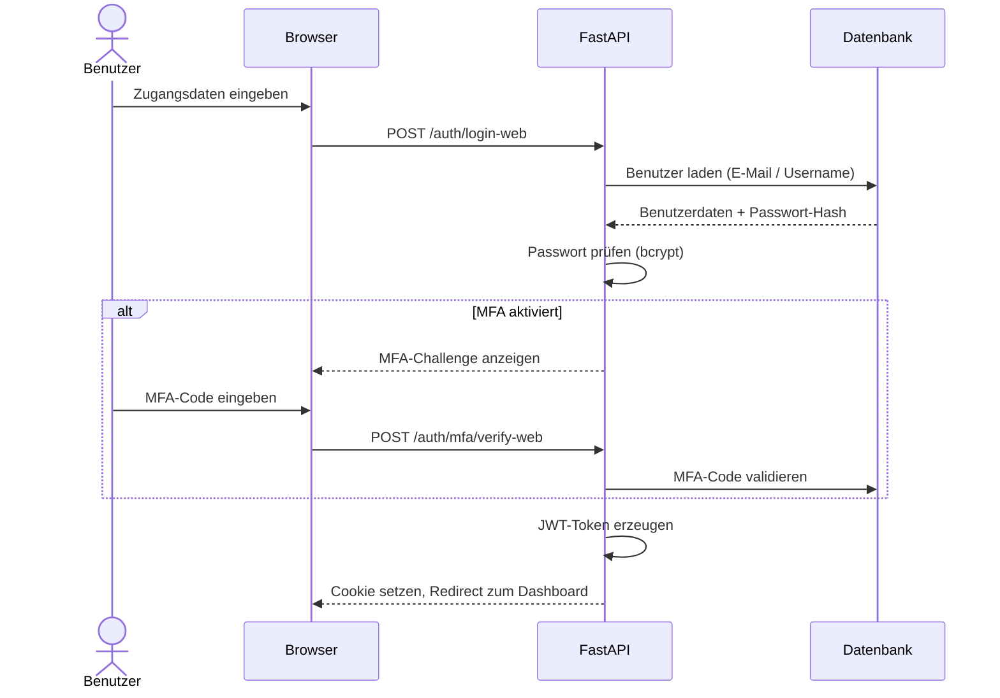
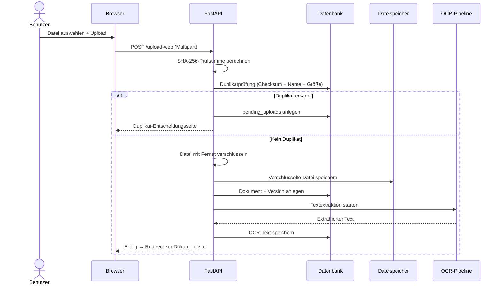

# Architektur

Die Systemarchitektur des Dokumentenmanagers wird hier aus Entwicklerperspektive dokumentiert. Die Beschreibung folgt dem C4-Modell und arbeitet sich von der Kontextebene über die Container-Ebene bis zur Komponentenbeschreibung vor.

---

## C4 – Kontextebene

Im Kontextmodell steht der Dokumentenmanager als zentrale Anwendung zwischen Benutzern und mehreren technischen Subsystemen. Der fachliche Kern ist nicht einfach „Datei hochladen", sondern die Orchestrierung aus Benutzerinteraktion, Metadatenhaltung, verschlüsselter Speicherung, Volltextsuche und Sicherheitslogik.

Der Benutzer interagiert über den Browser mit der Anwendung. Im Hintergrund kommuniziert das System mit der relationalen Datenbank für Metadaten, dem Dateisystem für verschlüsselte Dokumente, OCR-Werkzeugen für Textextraktion und einem SMTP-Server für Verifikations- und Reset-Mails.

---

## C4 – Container-Ebene

Auf Container-Ebene besteht das System aus vier Hauptbausteinen:

| Container | Technologie | Verantwortung |
|---|---|---|
| **Web-UI** | Jinja2-Templates, HTML/CSS/JS | Benutzeroberfläche für Upload, Suche, Verwaltung |
| **FastAPI-Backend** | Python, FastAPI, SQLAlchemy | Geschäftslogik, Authentifizierung, Verschlüsselung |
| **Datenbank** | MariaDB / MySQL | Relationale Metadaten, Benutzer, Token, Kategorien |
| **Dateispeicher** | Dateisystem mit Fernet | Verschlüsselte Binärdaten, getrennt von Metadaten |

---

## Komponentenarchitektur im Backend

Die Backend-Architektur folgt dem Prinzip der Schichtenarchitektur mit klarer Verantwortungstrennung. Routen, Geschäftslogik und Datenzugriff sind bewusst voneinander entkoppelt.

### Router-Schicht (`app/api/routes/`, `app/web/`)

Router definieren die extern sichtbaren Schnittstellen. Sie nehmen Anfragen entgegen, delegieren an die Service-Schicht und geben Antworten zurück. Die Trennung zwischen `api/routes/` (JSON-APIs) und `web/` (HTML-Routen) ermöglicht unabhängige Weiterentwicklung beider Kanäle.

### Service-Schicht (`app/services/`)

Hier lebt die eigentliche Geschäftslogik: Upload-Verarbeitung mit Duplikaterkennung, OCR-Workflows, Berechtigungsprüfungen, Versionierung, Favoritenverwaltung, Papierkorb-Bereinigung, MFA-Codes und E-Mail-Versand. Diese Schicht verhindert, dass Logik unkontrolliert in Routern zerfließt.

### Datenzugriff (`app/models/`, `app/repositories/`, `app/db/`)

SQLAlchemy-Modelle bilden die relationale Struktur ab. Repositories kapseln wiederkehrende Datenbankoperationen. Alembic sorgt für reproduzierbare Schema-Migrationen.

### Hilfsdienste (`app/utils/`)

Querschnittsfunktionen wie Fernet-Verschlüsselung, SHA-256-Hashing, Dateispeicher-Operationen und E-Mail-Hilfsfunktionen. Saubere Utility-Bereiche vermeiden Code-Duplikation.

---

## Beispielhafter Login-Ablauf

---

## Beispielhafter Upload-Ablauf

---

## Architekturentscheidungen

Die Architektur wurde bewusst modular aufgebaut, obwohl eine simplere Struktur (eine Datei, ein paar Routen, direkte SQL-Statements) kurzfristig schneller gewesen wäre. Die gewählte Schichtentrennung bringt konkrete Vorteile:

- **Testbarkeit**: Services lassen sich unabhängig von HTTP-Transporten testen.
- **Wartbarkeit**: Neue Features wie zusätzliche Dateitypen oder erweiterte Suche erfordern keine Umstrukturierung.
- **Teamfähigkeit**: Klare Modulverantwortlichkeiten reduzieren Merge-Konflikte.
- **Nachvollziehbarkeit**: Die Struktur selbst dokumentiert, wo welche Logik zu finden ist.
