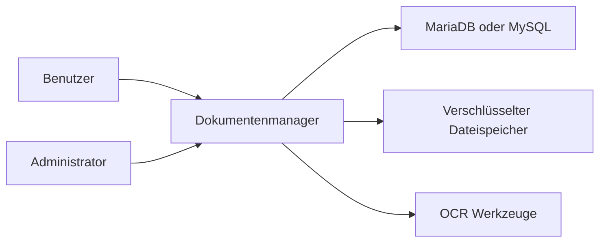
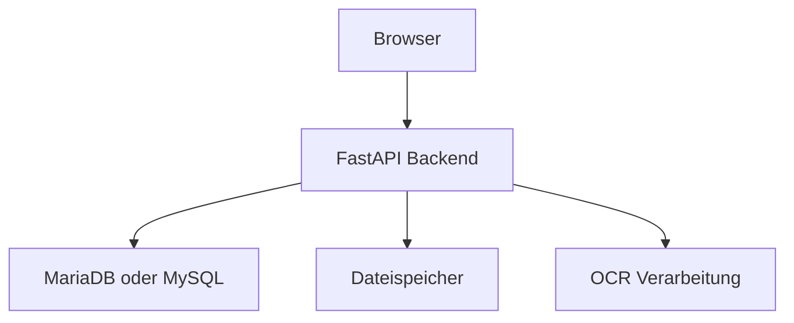
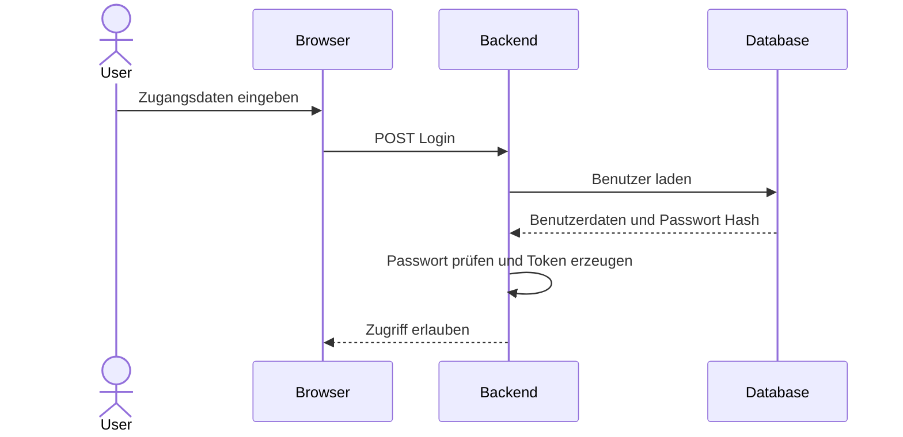

# Architektur

Diese Seite dokumentiert die Systemarchitektur des Dokumentenmanagers aus Entwicklerperspektive. Ziel ist nicht bloß eine hübsche Grafik, sondern eine nachvollziehbare Beschreibung der fachlichen und technischen Struktur. Gerade im Bewertungsraster ist entscheidend, dass die Konzeption konsistent, wartbar und verständlich dokumentiert wird. Deshalb wird hier das System erst im C4-Kontext eingeordnet und anschließend auf Container- und Komponentenebene textlich erläutert.

## C4 – Context Level

Im C4-Kontextmodell steht der Dokumentenmanager als zentrale Anwendung zwischen mehreren realen Anforderungen: Benutzer möchten Dokumente sicher speichern, schnell wiederfinden, bearbeiten, versionieren und bei Bedarf wiederherstellen. Die Anwendung kommuniziert mit einem relationalen Datenbanksystem und verarbeitet Dateien in einem separaten Speicherbereich. Optional greifen OCR-Werkzeuge ein, um Inhalte aus PDFs oder Bildern zu extrahieren. Das bedeutet: Der fachliche Kern des Systems ist nicht einfach „Datei hochladen“, sondern die Orchestrierung aus Benutzerinteraktion, Metadatenhaltung, verschlüsselter Speicherung, Suche und Sicherheitslogik.

## C4 – Container Level

Auf Container-Ebene besteht das System aus vier wesentlichen Bausteinen:

1. **Web-UI / Browserzugriff** – stellt die Benutzeroberfläche für Upload, Suche, Detailansicht, Papierkorb und Administration bereit.
2. **FastAPI-Backend** – bildet die zentrale Anwendungslogik, validiert Requests, steuert Authentifizierung, Verschlüsselung, Suchlogik, Versionierung und Datenzugriffe.
3. **MariaDB/MySQL-Datenbank** – speichert relationale Metadaten, Benutzerinformationen, Kategorien, Token, Versionen und weitere strukturierte Zustände.
4. **Verschlüsselter Dateispeicher** – hält die eigentlichen Dateien physisch getrennt von den Metadaten, wodurch Sicherheits- und Betriebsaspekte sauberer modellierbar werden.

## Komponentenbeschreibung im Backend

Die Backend-Architektur folgt dem Prinzip der Verantwortungsaufteilung. Das Projekt trennt dabei bewusst zwischen HTTP-naher Schicht, Fachlogik und Datenzugriff. Diese Trennung reduziert Kopplung und verhindert, dass Routen, Datenbankabfragen, Kryptologik und Validierung unkontrolliert ineinander laufen. Genau solche Vermischungen wirken anfangs praktisch, werden aber später zu Wartungsfallen.

### Router / Endpunkte

Router definieren die extern sichtbaren Schnittstellen des Systems. Hier werden Routen wie Authentifizierung, Upload, Suchfunktionen, Benutzerverwaltung oder Dokumentaktionen abgebildet. Router sind verantwortlich für die Entgegennahme der Anfrage, die Übergabe an Services und die Rückgabe der Antwort.

### Service-Schicht

Die Service-Schicht enthält die eigentliche Fachlogik. Hier wird entschieden, wie ein Dokument verarbeitet, wie ein Duplikat erkannt, wie eine Version erstellt oder wie eine Suche mit Metadaten und OCR-Inhalten kombiniert wird. Diese Schicht ist der Ort, an dem Geschäftsregeln leben sollten.

### Datenzugriff / Modelle

SQLAlchemy-Modelle bilden die relationale Struktur ab. Sie definieren Entitäten und Beziehungen und stellen sicher, dass Fachobjekte nachvollziehbar persistiert werden. Alembic sorgt dafür, dass Änderungen am Schema reproduzierbar dokumentiert und migriert werden können.

## Beispielhafter Login-Ablauf

## Warum diese Architektur sinnvoll ist

Für ein Schulprojekt wäre es möglich gewesen, eine deutlich simplere Struktur zu wählen: eine Datei, ein paar Routen, direkte SQL-Statements, ein Ordner für Uploads und fertig. Das hätte kurzfristig funktioniert, aber architektonisch kaum Aussagekraft gehabt. Die hier dokumentierte Struktur zeigt dagegen, dass das Projekt nicht nur funktioniert, sondern methodisch entwickelt wurde. Genau das macht die technische Kompetenz sichtbar und erfüllt den Developer-Fokus des Bewertungsrasters.
