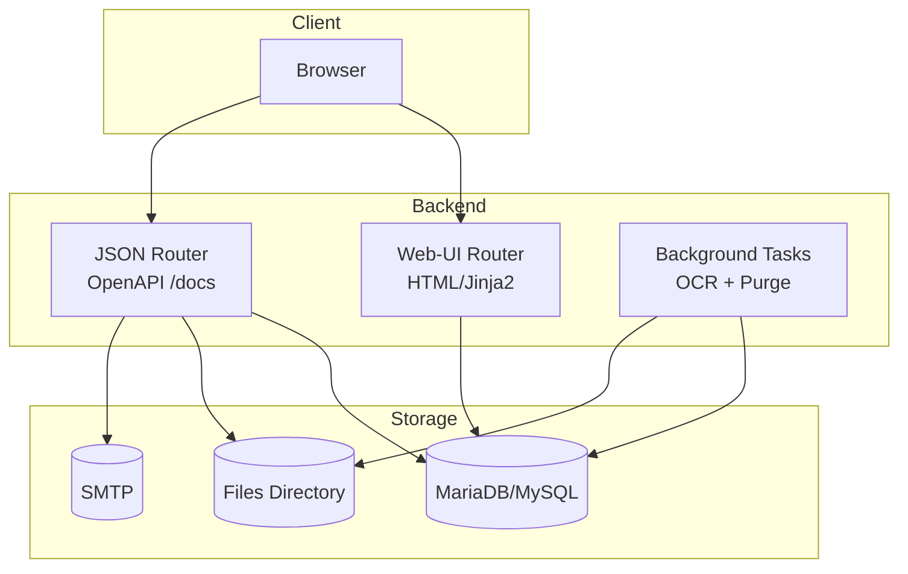

# Technische Dokumentation – Architektur

## Systemüberblick

Der Dokumentenmanager ist eine Webanwendung mit FastAPI. Die Web-UI wird serverseitig über Jinja2-Templates gerendert, zusätzlich existieren JSON-Endpunkte (Swagger unter `/docs`). Beim Start werden die ORM-Modelle initialisiert und ein Hintergrundtask bereinigt regelmäßig den Papierkorb.

## Architekturdiagramm v1 (Ist-Stand)

```mermaid
flowchart LR
  U[Benutzer: Browser] -->|HTTP| BE[FastAPI Backend\nWeb-UI (Jinja2) + JSON API]
  BE -->|SQLAlchemy| DB[(MariaDB/MySQL)]
  BE -->|Fernet| FS[(Dateisystem: FILES_DIR)]
  BE -->|SMTP| SMTP[(Mail Server)]
  BE -->|OCR| OCR[Tesseract + pdf2image + pypdf]
  BE -->|Background Task| TR[Trash Cleanup]
```

## Architekturdiagramm v2 (überarbeitet)

Ziel der Überarbeitung: klare Trennung zwischen Web-UI, API und Hintergrundarbeit (OCR/Retention), damit Wartbarkeit und spätere Skalierung nachvollziehbar werden.



## Relevante Module im Backend

- `app/main.py`: App-Setup, Router-Einbindung, Redirect von `/` auf `/dashboard`, Middleware-Redirect bei 401 (HTML) auf `/auth/login-web`.
- `app/web/routes_web.py`: Web-Routen (Dashboard, Upload, Suche, Kategorien/Keywords, Dokumente, Papierkorb, Favoriten).
- `app/api/routes/auth.py`: Register/Login, Verifikation und optionaler MFA-Flow.
- `app/api/routes/debug_ocr.py`: OCR-Testendpoint für PDF/Bild/DOCX.

## Datenfluss: Upload und Speicherung (vereinfacht)

1. Upload über Web-UI oder API (multipart)
2. Datei-Stream wird gespeichert und als Bytes verschlüsselt abgelegt (Fernet)
3. Integritäts-Tag (HMAC) und SHA256 werden zur Duplikatprüfung genutzt
4. OCR wird je nach Dateityp ausgeführt (PDF: Text-Layer, sonst OCR; Bild: OCR; DOCX: Text-Extraktion)
5. OCR-Text wird verschlüsselt in der DB gespeichert und für Suche/Ranking entschlüsselt verwendet

## Security (konkret)

- OpenAPI beschreibt global ein Bearer-Schema (JWT).
- Web-Login setzt `access_token` als HttpOnly-Cookie.
- E-Mail-Verifikation wird vor Freischaltung des Kontos geprüft.
- Optionaler MFA-Flow per E-Mail-Code (Challenge-ID + Verify).
- Dateien und OCR-Texte werden verschlüsselt gespeichert.
