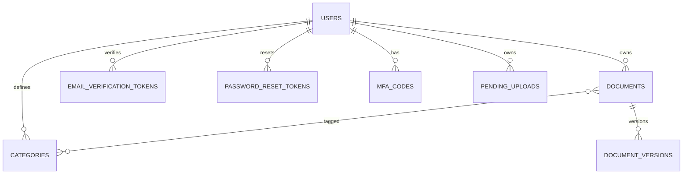

# Technische Dokumentation – Datenbankmodell

## Überblick

Die Anwendung nutzt SQLAlchemy (ORM) und Alembic (Migrationen). Die Verbindung wird über DB_URL aus der .env konfiguriert.

## Importierte Modelle (Ist-Zustand)

Beim Start werden diese Modelle geladen:

- User
- Category
- Document
- DocumentVersion
- DocumentCategories (Join-Tabelle)
- EmailVerificationToken
- PasswordResetToken
- MFACode
- PendingUpload

## Logisches Datenmodell (vereinfacht)



## Konsistenzregeln

- Fremdschlüsseltypen konsistent halten (z. B. user_id überall BIGINT oder überall INT).
- Soft-Delete über Flag (Papierkorb) statt physischem Löschen; endgültiges Löschen erfolgt zeitgesteuert (Retention).

## Migrationen (Pflichtschritt)

```bash
alembic upgrade head
```
