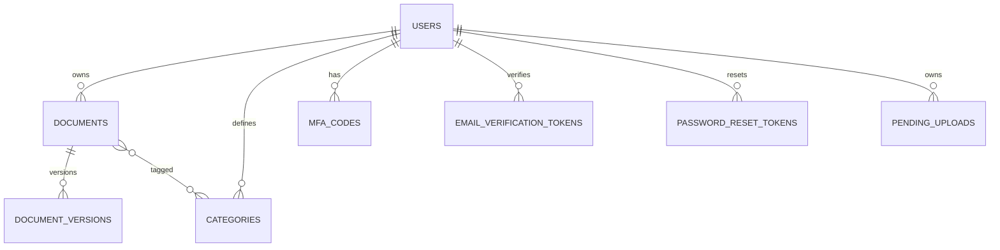

# Datenbankmodell

Das Datenbankmodell bildet das fachliche Rückgrat des Dokumentenmanagers. Während Dateien selbst verschlüsselt im Dateisystem liegen, verwaltet die relationale Datenbank alle Metadaten, Beziehungen, Suchtexte, Zustände und sicherheitsrelevanten Informationen. Gerade im Bewertungsraster ist dieser Teil zentral, weil sich hier zeigt, ob die Anwendung nicht nur funktioniert, sondern auch logisch sauber modelliert wurde.

## Kernobjekte

- **users**: Konten, Verifikation, optionale MFA, Berechtigungsbezug
- **documents**: Metadaten, Eigentumszuordnung, OCR-Inhalte, Zustandsflags
- **document_versions**: Versionierung einzelner Dokumentstände
- **categories**: Benutzerbezogene Kategorien mit optionalen Schlüsselwörtern
- **document_categories**: Many-to-Many-Beziehung zwischen Dokumenten und Kategorien
- **email_verification_tokens**, **password_reset_tokens**, **mfa_codes**
- **pending_uploads**: Zwischenspeicher für den Duplikat-Entscheidungsworkflow

## ER-Diagramm (vereinfacht)


```mermaid
erDiagram
  USERS ||--o{ DOCUMENTS : owns
  DOCUMENTS ||--o{ DOCUMENT_VERSIONS : versions
  USERS ||--o{ CATEGORIES : defines
  DOCUMENTS }o--o{ CATEGORIES : tagged
  USERS ||--o{ MFA_CODES : has
  USERS ||--o{ EMAIL_VERIFICATION_TOKENS : verifies
  USERS ||--o{ PASSWORD_RESET_TOKENS : resets
  USERS ||--o{ PENDING_UPLOADS : owns
```

## Fachliche Modellierungsentscheidung

Die Datenbank wurde nicht nach dem Motto „welche Tabellen brauchen wir ungefähr?“ aufgebaut, sondern entlang fachlicher Verantwortlichkeiten. Benutzende, Dokumente, Versionen und Kategorien sind jeweils eigenständige Entitäten. Das ist wichtig, weil damit spätere Erweiterungen wie Rechteverfeinerung, Protokollierung oder zusätzliche Dokumentattribute möglich bleiben, ohne das Schema grundsätzlich umzubauen.

## Detaillierte Beschreibung ausgewählter Tabellen

### users

Die Tabelle `users` verwaltet die grundlegende Identität eines Nutzers. Dazu gehören Login-Daten, Verifikationsstatus und MFA-relevante Zustände. Passwörter werden nicht im Klartext gespeichert, sondern gehasht. Dieser Punkt ist sicherheitstechnisch obligatorisch und signalisiert zugleich, dass das Projekt nicht nur funktional, sondern verantwortungsbewusst modelliert wurde.

### documents

`documents` ist die zentrale Metadatentabelle. Sie enthält unter anderem Dateiname, Pfad, MIME-Type, Prüfsummen, Dateigröße, Eigentümerbezug, OCR-Text und Statusinformationen wie Favorit oder Papierkorbzustand. Die Tabelle verbindet damit Suchbarkeit, Besitz, Dateiverwaltung und UI-Zustände.

### document_versions

Versionierung ist keine kosmetische Funktion, sondern fachlich wichtig. Wer ein Dokument überschreibt oder eine neue Fassung hochlädt, darf nicht gezwungen sein, alte Zustände endgültig zu verlieren. `document_versions` kapselt diese Historie und macht nachvollziehbar, welche Datei zu welchem Zeitpunkt gespeichert wurde.

### categories und document_categories

Kategorien sind benutzerbezogen modelliert. Das verhindert Konflikte zwischen globalen Kategoriesystemen und individuellen Organisationslogiken. Die separate Join-Tabelle `document_categories` bildet die n:m-Beziehung sauber ab und verhindert Redundanzen in der Tabelle `documents`.

### pending_uploads

Diese Tabelle ist besonders interessant, weil sie zeigt, dass das Projekt reale Workflow-Komplexität abbildet. Wenn ein möglicher Duplikatfall erkannt wird, wird der Upload nicht blind verworfen oder überschrieben. Stattdessen wird ein Zwischenzustand gespeichert, bis die Benutzerentscheidung vorliegt. Genau diese Art von Zwischendomäne fehlt vielen oberflächlichen CRUD-Projekten.

## Normalisierung

Das Schema orientiert sich an den Grundprinzipien der relationalen Modellierung und ist bis mindestens zur **3. Normalform** sinnvoll strukturiert.

### 1. Normalform

Alle Attribute sind atomar, also nicht als Listen oder verschachtelte Strukturen in einer Spalte abgelegt. Das erhöht Auswertbarkeit, Vergleichbarkeit und Integrität.

### 2. Normalform

Nichtschlüsselattribute hängen vollständig vom Primärschlüssel ab. Dies ist insbesondere bei Beziehungs- und Versionstabellen relevant, wo keine partiellen Abhängigkeiten akzeptiert werden dürfen.

### 3. Normalform

Transitive Abhängigkeiten werden vermieden. Beispielsweise werden Kategoriedaten nicht redundant in Dokumenttabellen repliziert, sondern über Beziehungen abgebildet. Dadurch sinkt die Redundanz und die Pflege wird konsistenter.

## Integritätsbedingungen

Eine saubere Datenbank lebt nicht nur von Tabellen, sondern von Regeln:

- **Primärschlüssel** sichern eindeutige Identität
- **Fremdschlüssel** sichern referenzielle Integrität
- **Unique Constraints** verhindern unerwünschte Dubletten, z. B. bei Kategorienamen pro Nutzerkontext
- **NOT NULL** stellt Mindestvollständigkeit sicher
- **Prüfsummen** unterstützen Duplikaterkennung und Integritätskontrolle

Gerade bei MariaDB/MySQL ist auf konsequente Typkonsistenz zwischen Primär- und Fremdschlüsseln zu achten. BIGINT auf der einen und INT auf der anderen Seite erzeugt den klassischen Datenbanksumpf, in dem Foreign Keys plötzlich schlechte Laune bekommen.

## Indizierung und Performance

Das Datenbankschema berücksichtigt nicht nur Korrektheit, sondern auch Zugriffsmuster. Sinnvolle Kandidaten für Indizes sind:

- `documents.owner_user_id`
- `documents.checksum_sha256`
- `documents.is_deleted`
- `document_versions.document_id`
- Join-Keys in Beziehungstabellen

Diese Indizes beschleunigen typische Operationen wie Dokumentlisten pro Nutzer, Duplikatprüfung, Versionsabrufe und Filter nach Papierkorbzustand. Ein unindiziertes System kann fachlich korrekt und trotzdem in der Praxis unerquicklich langsam sein. Performance ist also kein Luxus, sondern Teil funktionaler Qualität.

## Transaktionen und Konsistenz

Beim Upload oder bei der Versionierung werden mehrere Schritte miteinander verknüpft: Metadaten anlegen, Datei speichern, OCR-Texte verknüpfen, Kategorien zuordnen, Zustände setzen. Solche Prozesse müssen transaktional gedacht werden, damit keine halbfertigen Datensätze entstehen. Wenn eine Datei geschrieben, aber die Metadaten nicht gespeichert werden, ist das System formal inkonsistent. Daher ist die Trennung in nachvollziehbare Datenbankoperationen und klar definierte Fehlerbehandlung wichtig.

## Migrationen mit Alembic

Schemaänderungen werden über Alembic verwaltet:

```bash
alembic upgrade head
```

Diese Entscheidung ist im Schulprojekt besonders wertvoll, weil sie technische Reife demonstriert. Statt „man hat halt mal schnell die Tabelle angepasst“ existiert damit ein nachvollziehbarer Entwicklungspfad des Schemas. Das ist für Teamarbeit, Versionskontrolle und spätere Abnahme deutlich professioneller.

## Fazit zum Datenbankmodell

Das Datenbankmodell des Dokumentenmanagers ist nicht überengineert, aber klar strukturiert und fachlich begründet. Es unterstützt Sicherheit, Versionierung, Suchbarkeit, Rollenbezug und Workflow-Zwischenzustände. Dadurch ist es sowohl aus Nutzersicht funktional als auch aus Entwicklersicht wartbar und erweiterbar.
