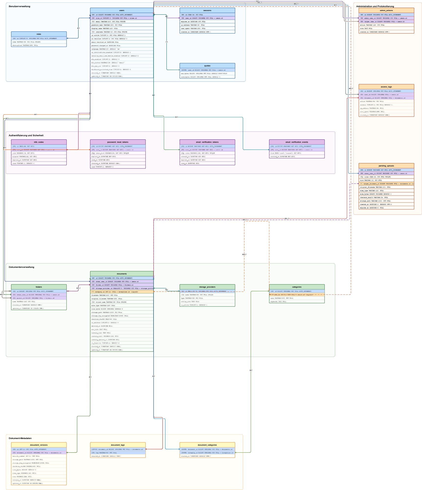
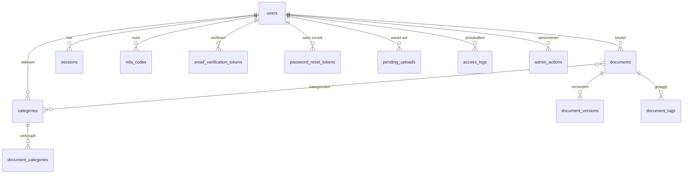

# Datenbankmodell

Das Datenbankmodell bildet das fachliche Rückgrat des Dokumentenmanagers. Während Dateien verschlüsselt im Dateisystem liegen, verwaltet die relationale Datenbank alle Metadaten, Beziehungen, Suchtexte, Zustände und sicherheitsrelevante Informationen.

---

## Logisches Datenbankmodell

Das vollständige Datenbankmodell zeigt alle Tabellen, Spalten, Datentypen und Beziehungen:

{ loading=lazy }

[📥 Datenbankmodell als .drawio herunterladen](../assets/downloads/datenbankmodell.drawio){ .md-button }
[🖼️ Datenbankmodell als PNG herunterladen](../assets/images/datenbankmodell.png){ .md-button .md-button--primary }

---

## ER-Diagramm (vereinfacht)


```mermaid
erDiagram
    users ||--o{ documents : "besitzt"
    users ||--o{ categories : "definiert"
    users ||--o{ sessions : "hat"
    users ||--o{ mfa_codes : "nutzt"
    users ||--o{ email_verification_tokens : "verifiziert"
    users ||--o{ password_reset_tokens : "setzt zurück"
    users ||--o{ pending_uploads : "wartet auf"

    documents ||--o{ document_versions : "versioniert"
    documents }o--o{ categories : "kategorisiert"
    documents ||--o{ document_tags : "getaggt"

    categories ||--o{ document_categories : "verknüpft"

    users ||--o{ access_logs : "protokolliert"
    users ||--o{ admin_actions : "administriert"
```

---

## Fachbereiche im Schema

Das Datenbankschema gliedert sich in vier logische Bereiche, die im Diagramm farblich gekennzeichnet sind:

### Benutzerverwaltung

| Tabelle | Zweck |
|---|---|
| `users` | Benutzerkonten mit Login-Daten, Verifikationsstatus, MFA-Konfiguration und Spracheinstellung |
| `roles` | Rollendefinitionen (z. B. Standardbenutzer, Administrator) |
| `sessions` | Aktive Benutzersitzungen mit Token-Referenz und Ablaufzeit |
| `quotes` | Motivationszitate für die Dashboard-Anzeige |

### Authentifizierung und Sicherheit

| Tabelle | Zweck |
|---|---|
| `mfa_codes` | Temporäre MFA-Codes für die Zwei-Faktor-Authentifizierung per E-Mail |
| `password_reset_tokens` | Token für den Passwort-Reset-Workflow mit Ablaufzeit |
| `email_verification_tokens` | Token zur E-Mail-Verifikation bei der Registrierung |
| `email_verification_events` | Protokoll über Verifikationsereignisse |

### Dokumentenverwaltung

| Tabelle | Zweck |
|---|---|
| `documents` | Zentrale Metadatentabelle: Dateiname, Pfad, MIME-Type, Prüfsumme, Größe, OCR-Text, Favoriten- und Papierkorbstatus |
| `folders` | Ordnerstruktur für hierarchische Organisation |
| `categories` | Benutzerbezogene Kategorien mit verschlüsselten Keywords |
| `storage_providers` | Konfiguration der Speicher-Backends |
| `pending_uploads` | Zwischenspeicher für den Duplikat-Entscheidungsworkflow |

### Dokument-Metadaten

| Tabelle | Zweck |
|---|---|
| `document_versions` | Versionierte Dokumentstände mit eigenem Speicherpfad und Prüfsumme |
| `document_tags` | Zuordnung von Tags zu Dokumenten |
| `document_categories` | Join-Tabelle für die n:m-Beziehung zwischen Dokumenten und Kategorien |

### Administration und Protokollierung

| Tabelle | Zweck |
|---|---|
| `access_logs` | Zugriffsprotokoll mit IP-Adresse und Zeitstempel |
| `admin_actions` | Protokoll administrativer Aktionen |

---

## Detaillierte Tabellenbeschreibung

### `users`

Die Tabelle verwaltet die Identität eines Nutzers. Zentrale Spalten:

- `id` (BIGINT, PK) – Eindeutige Benutzer-ID
- `role_id` (SMALLINT, FK → `roles`) – Rollenzuordnung
- `username` (VARCHAR 50, UNIQUE) – Eindeutiger Benutzername
- `email` (VARCHAR 255, UNIQUE) – E-Mail-Adresse
- `password_hash` (VARCHAR 255) – Bcrypt-gehashtes Passwort
- `is_verified` (BOOLEAN) – E-Mail-Verifikationsstatus
- `mfa_enabled` / `mfa_method` – MFA-Konfiguration
- `language` (VARCHAR 10) – Sprachpräferenz (Standard: `de`)
- `dashboard_protected_view` (BOOLEAN) – Geschützte Dashboard-Ansicht

Passwörter werden niemals im Klartext gespeichert. Die Kombination aus Bcrypt-Hashing und optionaler MFA bildet die erste Verteidigungslinie des Systems.

### `documents`

Die zentrale Metadatentabelle verbindet Suchbarkeit, Besitz, Dateiverwaltung und UI-Zustände:

- `id` (BIGINT, PK) – Dokumenten-ID
- `owner_user_id` (BIGINT, FK → `users`, INDEX) – Eigentümer
- `filename` / `original_filename` (VARCHAR) – Anzeige- und Originalname
- `storage_path` (VARCHAR 1000) – Pfad zur verschlüsselten Datei
- `stored_name` (VARCHAR 64, UNIQUE) – Interner Speichername
- `size_bytes` (BIGINT) – Dateigröße
- `checksum_sha256` (VARCHAR 64) – SHA-256-Prüfsumme für Duplikaterkennung
- `mime_type` (VARCHAR 120) – MIME-Typ der Datei
- `ocr_text` (TEXT) – Extrahierter OCR-Volltext
- `is_favorite` (BOOLEAN, INDEX) – Favoritenstatus
- `is_deleted` (BOOLEAN) – Soft-Delete für Papierkorblogik
- `deleted_at` (TIMESTAMP, INDEX) – Löschzeitpunkt für automatische Bereinigung
- `created_at` (TIMESTAMP) – Erstellungszeitpunkt

### `document_versions`

Versionierung als fachlich wichtige Funktion, nicht als Kosmetik. Wer ein Dokument überschreibt, darf alte Zustände nicht verlieren:

- `id` (BIGINT, PK) – Versions-ID
- `document_id` (BIGINT, FK → `documents`) – Zugehöriges Dokument
- `version_number` (INT) – Fortlaufende Versionsnummer
- `storage_path` (VARCHAR) – Separater Speicherpfad der Version
- `checksum_sha256` (VARCHAR 64) – Prüfsumme der Version
- `size_bytes` (BIGINT) – Dateigröße der Version
- `created_at` / `updated_at` (TIMESTAMP) – Zeitstempel

### `categories` und `document_categories`

Kategorien sind benutzerbezogen modelliert, um Konflikte zwischen individuellen Organisationslogiken zu vermeiden. Keywords werden verschlüsselt gespeichert (`encrypt_text` / `decrypt_text`). Die separate Join-Tabelle `document_categories` bildet die n:m-Beziehung sauber ab.

### `pending_uploads`

Diese Tabelle zeigt, dass das Projekt reale Workflow-Komplexität abbildet. Bei erkannten Duplikaten wird der Upload nicht blind verworfen, sondern als Zwischenzustand gespeichert, bis die Benutzerentscheidung vorliegt:

- `target_document_id` (BIGINT, FK → `documents`) – Referenz auf das potenzielle Duplikat
- `original_filename` / `mime_type` / `size_bytes` – Metadaten des Uploads
- `storage_path` (VARCHAR) – Temporärer Speicherpfad
- `expires_at` (DATETIME) – Automatische Bereinigung nach Ablauf

---

## Normalisierung

Das Schema ist bis mindestens zur **dritten Normalform** strukturiert:

**1NF** – Alle Attribute sind atomar. Keine Listen oder verschachtelten Strukturen in Spalten.

**2NF** – Nichtschlüsselattribute hängen vollständig vom Primärschlüssel ab. Keine partiellen Abhängigkeiten in Beziehungstabellen.

**3NF** – Transitive Abhängigkeiten werden vermieden. Kategoriedaten werden nicht redundant in Dokumenttabellen repliziert, sondern über Beziehungen abgebildet.

---

## Integritätsbedingungen

- **Primärschlüssel** auf allen Tabellen (`BIGINT AUTO_INCREMENT`)
- **Fremdschlüssel** mit `ON DELETE CASCADE` für referenzielle Integrität
- **Unique Constraints** auf `users.username`, `users.email`, `documents.stored_name`
- **NOT NULL** für Pflichtspalten wie `filename`, `storage_path`, `password_hash`
- **SHA-256-Prüfsummen** auf Dokumenten für Duplikaterkennung und Integritätskontrolle
- **Typkonsistenz** zwischen Primär- und Fremdschlüsseln (durchgehend `BIGINT`)

---

## Indizierung

Sinnvolle Indizes beschleunigen die typischen Zugriffsmuster:

| Index | Zweck |
|---|---|
| `documents.owner_user_id` | Dokumentliste pro Benutzer |
| `documents.checksum_sha256` | Duplikatprüfung |
| `documents.is_deleted` / `deleted_at` | Papierkorb-Filterung und -Bereinigung |
| `documents.is_favorite` | Favoritenliste |
| `document_versions.document_id` | Versionsabruf |
| `categories.user_id` | Kategorieliste pro Benutzer |

---

## Migrationen mit Alembic

Schemaänderungen werden über Alembic verwaltet:

```bash
alembic upgrade head        # Schema auf aktuellen Stand bringen
alembic revision --autogenerate -m "Beschreibung"  # Neue Migration erzeugen
alembic downgrade -1        # Letzte Migration zurückrollen
```

Alembic stellt sicher, dass sich das Schema nachvollziehbar und versionskontrolliert entwickelt – wesentlich professioneller als manuelle SQL-Anpassungen.
