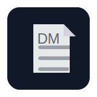

# Dokumentenmanager

{ width="120" }

## Kurzbeschreibung (Value Proposition)

Viele Studierende, Freelancer und kleine Teams verlieren Zeit, weil Dokumente verstreut abgelegt sind und Scans/PDFs ohne OCR praktisch nicht durchsuchbar sind.
Der Dokumentenmanager richtet sich an Nutzerinnen und Nutzer, die eine selbst gehostete, nachvollziehbare Ablage mit klaren Kategorien, schneller Suche und sinnvollen Sicherheitsmechanismen benötigen.
Die Anwendung verwaltet Metadaten in MariaDB/MySQL, speichert Dateien verschlüsselt im Dateisystem und extrahiert Text aus PDFs/Bildern per OCR, damit Inhalte durchsuchbar werden.
Zusätzlich unterstützt sie Versionierung, Favoriten und einen Papierkorb, damit Änderungen nachvollziehbar bleiben und Fehlbedienungen abgefedert werden.

## Kernfunktionen (Auszug)

- Registrierung/Login mit E-Mail-Verifikation, optionalem MFA (E-Mail-Code)
- Dokument-Upload, verschlüsselte Ablage, Download und Vorschau
- OCR für Bilder/PDFs (Tesseract + pdf2image/Poppler) und Volltextsuche über OCR-Text
- Kategorien mit Keywords und Keyword-Vorschlägen
- Versionierung, Favoriten, Papierkorb

## Einstiegspunkte

- Web-UI (Backend): http://127.0.0.1:8000/ (Weiterleitung auf /dashboard)
- Swagger UI: http://127.0.0.1:8000/docs
- Frontend (optional): http://127.0.0.1:5173/ (falls genutzt)

## Navigation

- Installation & Quick Start
- Technische Dokumentation (Architektur, Datenbankmodell, API, Projektstruktur)
- Nutzungshandbuch (Use-Cases, UI, Beispieldaten)
- Technische Strategie (Trade-offs, Risiken, Lösungen)