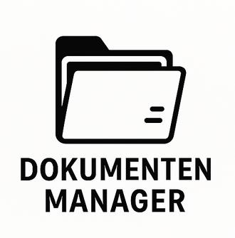

# Dokumentenmanager

{ width="260" }

## Strukturierte, sichere und nachvollziehbare Dokumentenverwaltung

Der Dokumentenmanager ist eine webbasierte Softwarelösung zur zentralen Ablage, Kategorisierung, Verschlüsselung und Recherche digitaler Dokumente. Das Projekt adressiert das in vielen kleinen Teams, Projektgruppen und Lernumgebungen auftretende Problem, dass Dateien unstrukturiert auf lokalen Laufwerken, in Messenger-Verläufen oder in unsystematischen Ordnerstrukturen verteilt werden und dadurch nur mit hohem Zeitaufwand, Unsicherheit und Medienbrüchen wiedergefunden werden können. Die Anwendung richtet sich an Nutzerinnen und Nutzer, die eine nachvollziehbare, selbst kontrollierbare und technisch saubere Dokumentenorganisation benötigen und dabei sowohl funktionale Aspekte wie Upload, Suche, Kategorien und Versionen als auch sicherheitsrelevante Aspekte wie Zugriffskontrolle, Passwortschutz und verschlüsselte Ablage berücksichtigen möchten. Die Software löst dieses Problem durch eine modulare Webarchitektur mit FastAPI, relationaler Persistenz, OCR-gestützter Volltextverarbeitung, versionierbarer Dokumenthistorie, Favoriten und Papierkorb-Logik und schafft damit eine belastbare Grundlage für effiziente, wartbare und künftig erweiterbare Dokumentenprozesse.

## Warum das Projekt relevant ist

In vielen realen Arbeitsumgebungen ist die eigentliche Ablage von Dateien nicht das Kernproblem, sondern deren spätere Wiederauffindbarkeit, Nachvollziehbarkeit und sichere Verwaltung. Ein Dokument ist schnell gespeichert, aber ohne konsistente Metadaten, Kategorien, Suchbarkeit und Zugriffsmodell entsteht über die Zeit ein Datenfriedhof mit hübscher Oberfläche. Genau dort setzt der Dokumentenmanager an. Das Projekt verbindet Dateispeicherung, fachliche Strukturierung und technische Schutzmechanismen in einer Anwendung, die nicht nur „Dateien irgendwo hochlädt“, sondern den gesamten Umgang mit Dokumenten als durchgängigen Prozess modelliert: erfassen, verschlagworten, durchsuchen, versionieren, wiederherstellen und kontrolliert löschen.

## Navigation

- [Installation & Quick Start](installation-quickstart.md)
- [Architektur](developer/architecture.md)
- [Datenbankmodell](developer/database.md)
- [API-Referenz](developer/api.md)
- [Projektstruktur](developer/file-structure.md)
- [Sicherheitskonzept](developer/security.md)
- [Nutzungshandbuch](user-guide/overview.md)
- [Technische Strategie](technical-strategy.md)
- [Betrieb & Deployment](operations.md)
- [Format & Abgabe](format-deliverables.md)

## Kernfunktionen auf einen Blick

- verschlüsselte Dateiablage im Dateisystem
- relationale Verwaltung von Metadaten in MariaDB/MySQL
- OCR für PDFs und Bilder zur Volltextsuche
- Kategorien, Keywords und Suchfilter
- Versionierung von Dokumenten
- Favoritenfunktion für schnellen Zugriff
- Papierkorb mit Wiederherstellung und automatischer Bereinigung
- rollenbasierte Logik für Benutzerverwaltung und Zugriffsschutz
