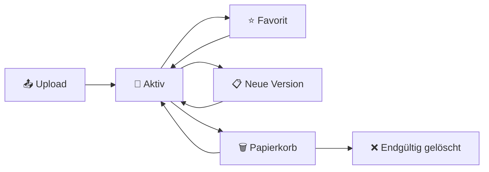

# Nutzungshandbuch

Dieses Handbuch richtet sich an Endanwender des Dokumentenmanagers. Es beschreibt die wichtigsten Funktionen entlang typischer Arbeitsabläufe, damit neue Nutzer die Software schnell und produktiv einsetzen können.

---

## Einstieg

Nach dem Start der Anwendung leitet die Root-URL (`/`) automatisch zum Dashboard weiter. Von dort sind alle Hauptfunktionen direkt erreichbar. Ein neuer Benutzer muss im Regelfall nur drei Dinge verstehen:

1. **Wie lade ich Dokumente hoch?**
2. **Wie finde ich sie später wieder?**
3. **Wie verhindere ich versehentliche Verluste?**

---

## Hauptfunktionen

| Funktion | Beschreibung |
|---|---|
| Registrierung & Login | Benutzerkonto erstellen, E-Mail verifizieren, anmelden |
| Dashboard | Übersicht über Dokumente, Kennzahlen und Schnellzugriffe |
| Upload | Dateien hochladen mit automatischer OCR und Kategorisierung |
| Dokumentübersicht | Alle eigenen Dokumente sortiert und filterbar |
| Volltextsuche | Dokumente über Titel, OCR-Text und Metadaten finden |
| Kategorien & Keywords | Eigene Kategorien mit Schlüsselwörtern definieren |
| Favoriten | Häufig genutzte Dokumente für Schnellzugriff markieren |
| Versionierung | Neue Versionen hochladen, ältere Stände wiederherstellen |
| Papierkorb | Gelöschte Dokumente wiederherstellen oder endgültig entfernen |
| Duplikaterkennung | Intelligente Erkennung mit Entscheidungsworkflow |

---

## Use-Cases

### Use-Case 1: Registrierung und Dashboard

Ein neuer Benutzer registriert sich mit E-Mail und Passwort, verifiziert die E-Mail-Adresse und meldet sich an. Das Dashboard zeigt einen strukturierten Überblick über Kennzahlen, zuletzt hochgeladene Dateien und zentrale Navigationspunkte.

{ loading=lazy }

### Use-Case 2: Dokument hochladen

1. Upload-Seite öffnen (über Navigation oder Dashboard)
2. Datei auswählen (PDF oder DOCX)
3. Optional Kategorien zuweisen
4. Upload bestätigen

Im Hintergrund wird die Datei geprüft, verschlüsselt gespeichert und in der Datenbank erfasst. Falls OCR verfügbar ist, wird zusätzlicher Text extrahiert, der die spätere Suche verbessert.

{ loading=lazy }

!!! info "Duplikaterkennung"
    Erkennt das System einen möglichen Duplikatfall (gleiche Prüfsumme oder Name+Größe), wird der Benutzer in einen Entscheidungsworkflow geführt: Entweder das Duplikat übernehmen oder den Upload verwerfen. Kein stillschweigendes Überschreiben.

### Use-Case 3: Dokumente über Volltextsuche finden

Ein Benutzer erinnert sich nicht an den Dateinamen, aber an einen inhaltlichen Begriff. Die Suchseite durchsucht nicht nur Titel, sondern auch OCR-extrahierte Inhalte. Ergebnisse werden nach Relevanz sortiert mit hervorgehobenen Treffern angezeigt.

{ loading=lazy }

### Use-Case 4: Dokumentdetail prüfen

In der Detailansicht sind Metadaten, Kategorien, Versionshistorie und Aktionen (Download, Umbenennen, Löschen, Favoritenstatus) gebündelt. Für bestimmte Dateitypen wird eine Vorschau direkt im Browser angezeigt.

{ loading=lazy }

### Use-Case 5: Favoriten markieren

Häufig genutzte Dokumente können als Favoriten markiert werden. Die Favoritenübersicht bietet Schnellzugriff auf die wichtigsten Unterlagen und reduziert den Suchaufwand im Alltag.

### Use-Case 6: Papierkorb und Wiederherstellung

Dokumente werden nicht sofort gelöscht, sondern zunächst in den Papierkorb verschoben. Von dort können sie wiederhergestellt oder nach einer konfigurierbaren Frist automatisch bereinigt werden.

{ loading=lazy }

### Use-Case 7: Kategorien verwalten

Benutzer können eigene Kategorien definieren und mit Schlüsselwörtern anreichern. Schlüsselwörter werden verschlüsselt gespeichert und unterstützen die automatische Kategorisierung beim Upload.

{ loading=lazy }

### Use-Case 8: Versionierung

Beim Upload einer neuen Version eines bestehenden Dokuments bleibt die Versionshistorie erhalten. Ältere Stände können jederzeit wiederhergestellt werden, ohne den aktuellen Stand zu verlieren.

### Use-Case 9: MFA aktivieren

Über das Profil kann die Zwei-Faktor-Authentifizierung per E-Mail aktiviert werden. Nach der Aktivierung wird bei jedem Login ein zusätzlicher Code an die registrierte E-Mail-Adresse gesendet.

---

## Dokumentenlebenszyklus

Jedes Dokument durchläuft einen definierten Lebenszyklus: vom Upload über aktive Nutzung (mit optionalen Favoriten und Versionierung) bis zur kontrollierten Löschung über den Papierkorb.
