# UI-Screenshots

Die folgenden Abbildungen zeigen die wichtigsten Arbeitsbereiche der Anwendung und ergänzen die Use-Cases im Nutzungshandbuch.

---

## Login

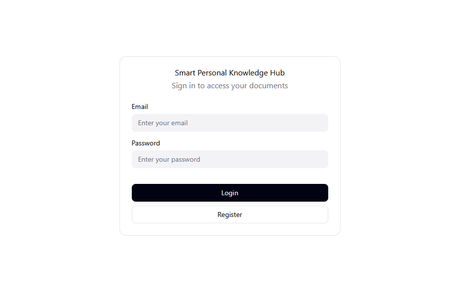{ loading=lazy }

Die Einstiegsseite für Benutzer mit Eingabefeldern für E-Mail/Benutzername und Passwort. Von hier aus ist auch die Registrierung und der Passwort-Reset erreichbar.

## Dashboard

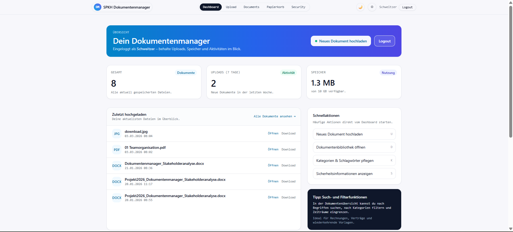{ loading=lazy }

Das Dashboard zeigt Kennzahlen, zuletzt hochgeladene Dateien und zentrale Navigationspunkte. Es dient als Startfläche nach dem Login und gibt innerhalb weniger Sekunden Orientierung.

## Upload

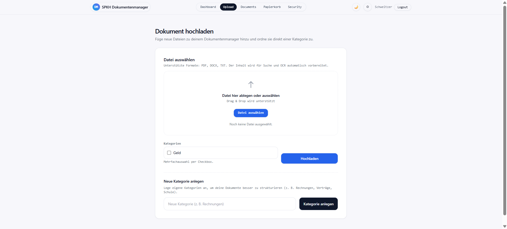{ loading=lazy }

Die Upload-Ansicht zeigt den Kernprozess: Datei auswählen, optional Kategorie zuordnen und das Dokument strukturiert in das System übernehmen.

## Dokumentübersicht

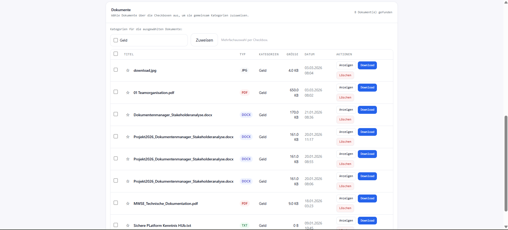{ loading=lazy }

Die Listenansicht aller gespeicherten Dokumente mit Titel, Dateityp, Größe, Datum und Aktionen. Sortierung und Filterung sind direkt verfügbar.

## Suche

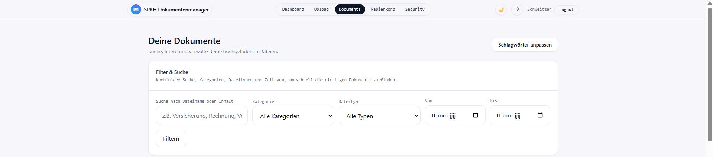{ loading=lazy }

Die Volltextsuche durchsucht Titel, OCR-Text und Metadaten. Treffer werden mit hervorgehobenen Suchbegriffen angezeigt.

## Dokumentdetail

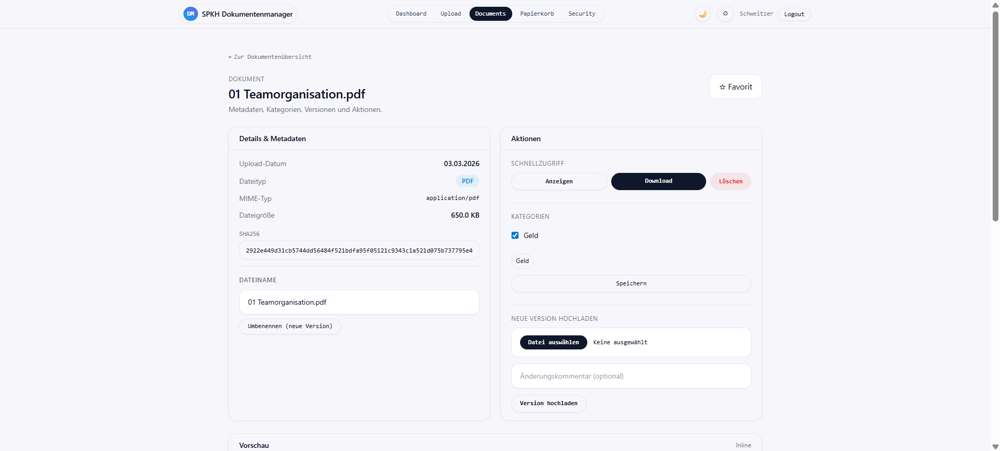{ loading=lazy }

Die Detailansicht bündelt Metadaten, Kategorien, Versionshistorie und Aktionen wie Download, Umbenennung oder Löschung.

## Papierkorb

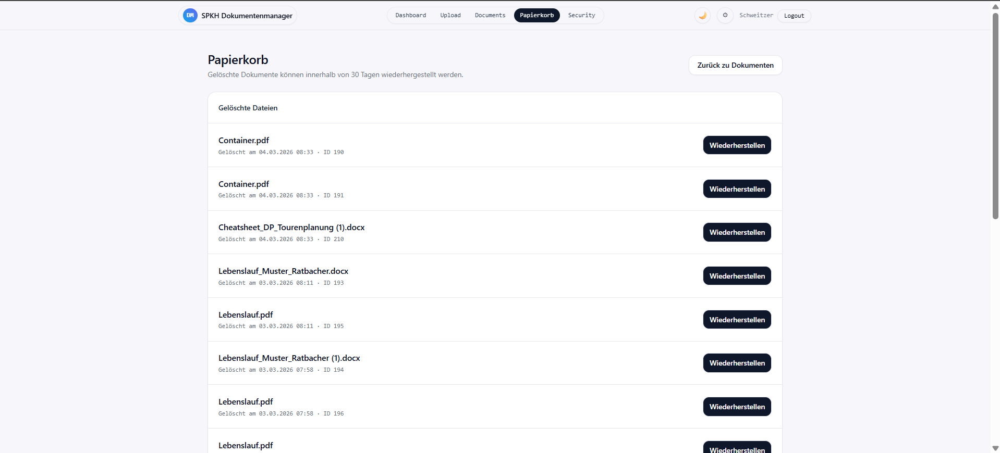{ loading=lazy }

Der Papierkorb zeigt alle soft-gelöschten Dokumente mit Option zur Wiederherstellung.

## Kategorien & Keywords

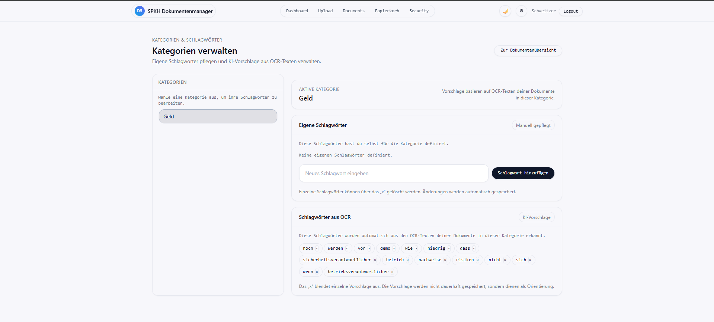{ loading=lazy }

Verwaltung benutzerdefinierter Kategorien mit verschlüsselten Schlüsselwörtern für automatische Kategorisierung.

---

## Mockups (Designkonzepte)

Die folgenden Mockups zeigen die ursprünglichen Designkonzepte, die als Grundlage für die Implementierung dienten:

| Bereich | Mockup |
|---|---|
| Dashboard | 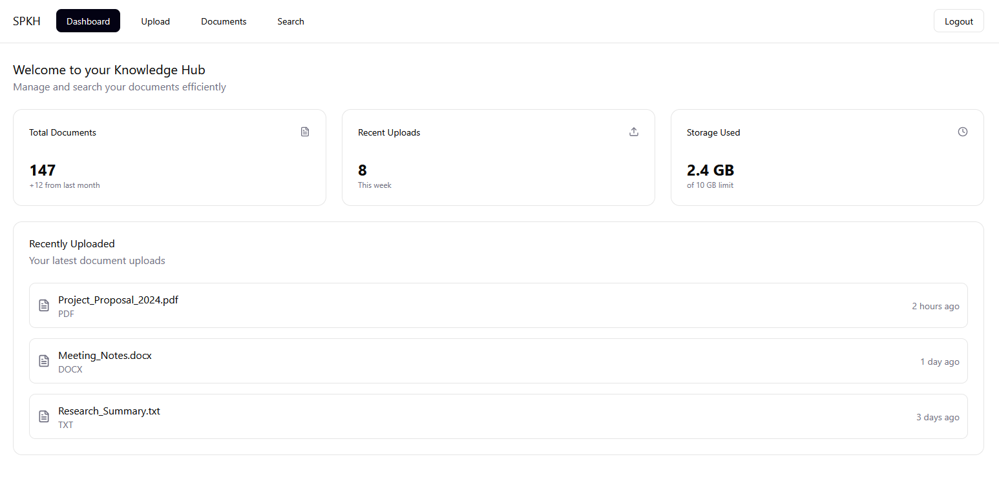{ width="400" loading=lazy } |
| Upload | 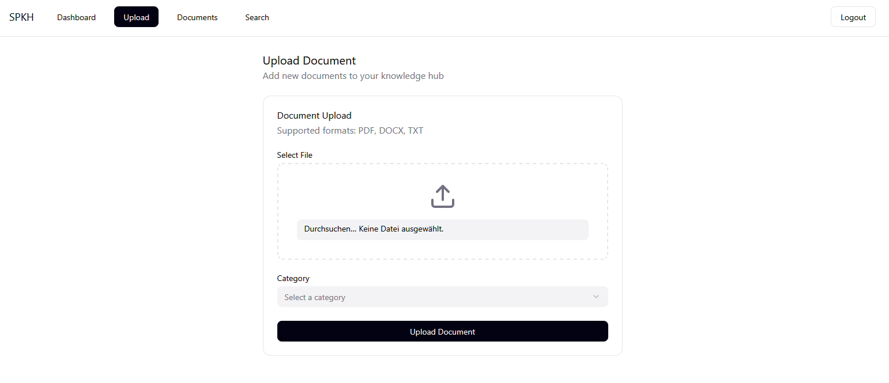{ width="400" loading=lazy } |
| Dokumentübersicht | 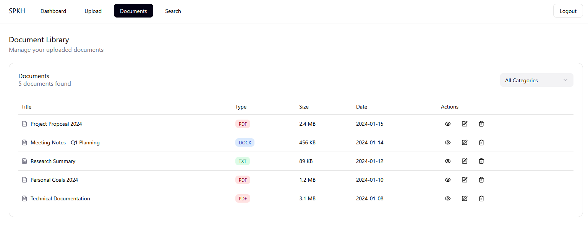{ width="400" loading=lazy } |
| Suche | 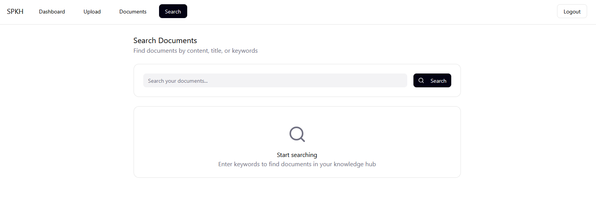{ width="400" loading=lazy } |
| Dokumentdetail | 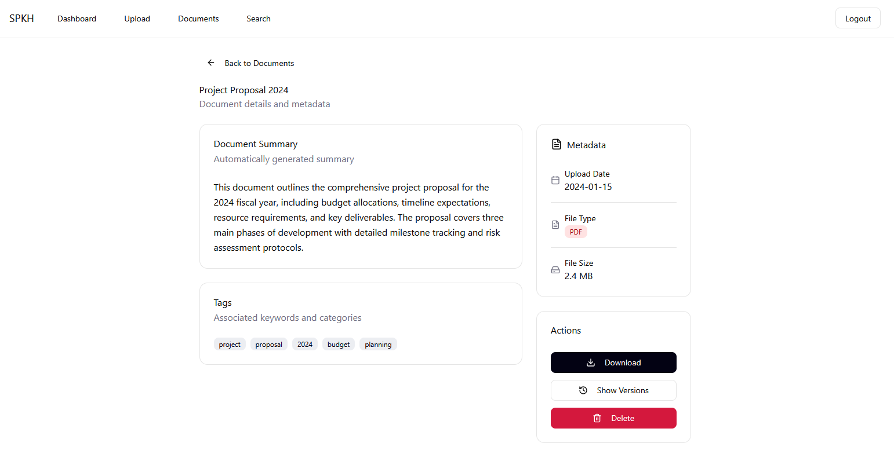{ width="400" loading=lazy } |
